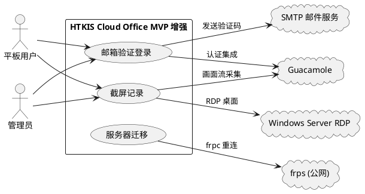
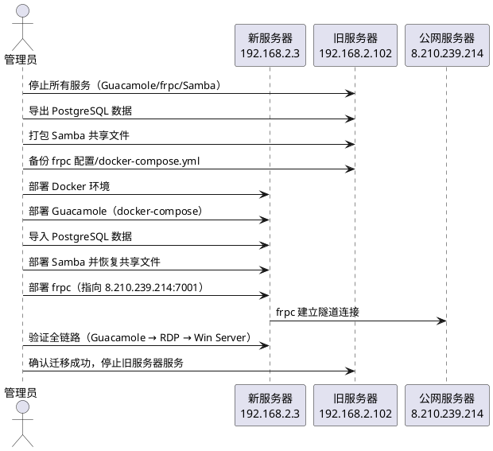
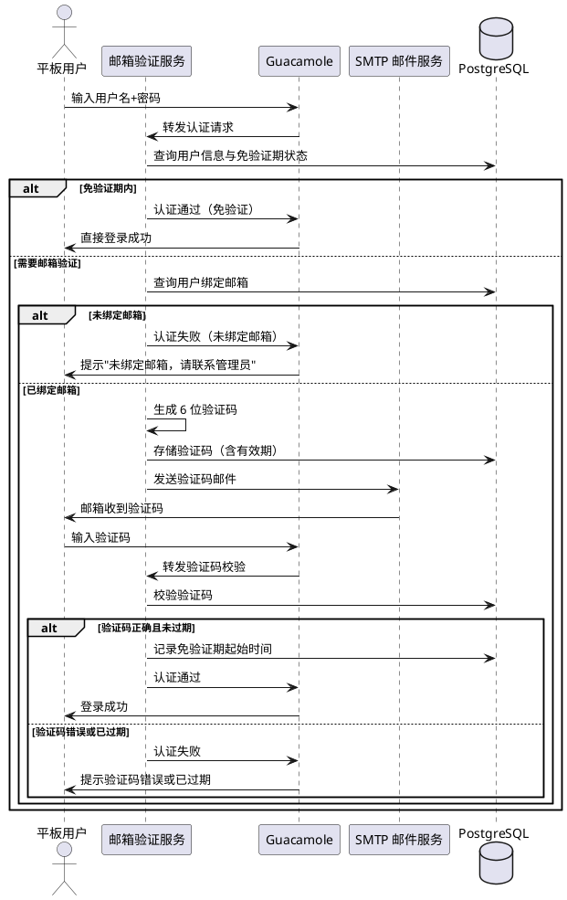
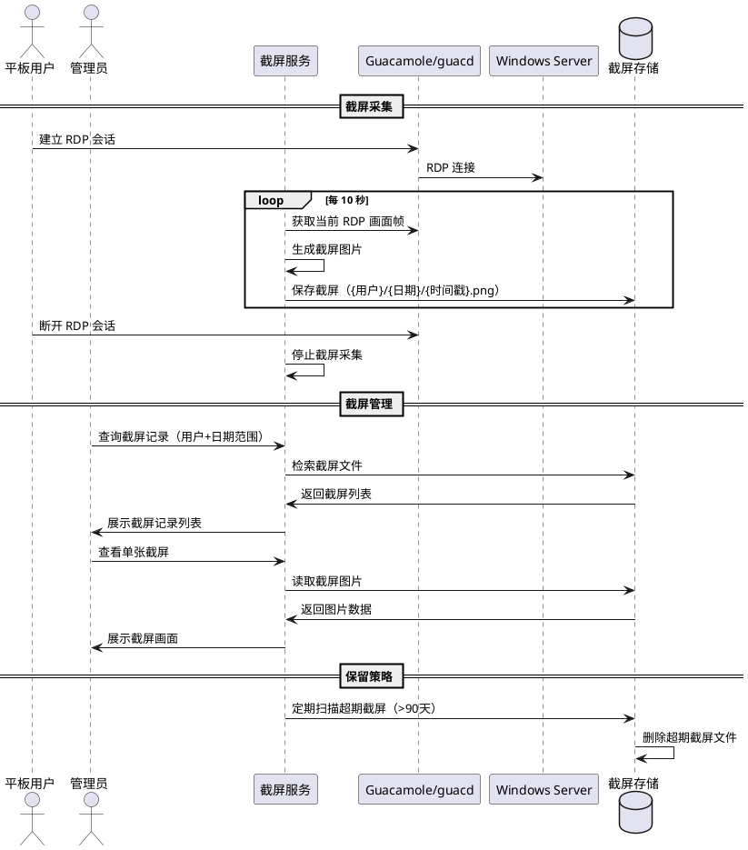

# 1. 组件定位

## 1.1 核心职责

本组件负责 HTKIS Cloud Office 平台的三项 MVP 增强能力：服务器迁移、邮箱验证登录、用户截屏记录，实现平台稳定性与安全合规性提升。

## 1.2 核心输入

1. **用户登录请求**：用户通过浏览器提交用户名、密码、邮箱验证码
2. **管理员操作指令**：管理员绑定/修改用户邮箱、查看截屏记录
3. **RDP 桌面画面流**：Guacamole guacd 层面的 RDP 图形数据流
4. **定时截屏触发信号**：每 10 秒触发的截屏采集信号
5. **迁移源服务器状态**：192.168.2.102 上的服务运行状态与数据

## 1.3 核心输出

1. **邮箱验证码**：发送到用户绑定邮箱的 6 位数字验证码
2. **登录认证结果**：验证通过/失败的认证响应
3. **截屏图片文件**：按用户+日期组织的 PNG/JPEG 截屏文件
4. **截屏管理界面**：管理员查看历史截屏的 Web 页面
5. **迁移后服务可用性**：192.168.2.3 上完整恢复的所有服务

## 1.4 职责边界

- **不负责** Guacamole 核心源码修改，所有扩展通过外部服务或 API 集成实现
- **不负责** Windows Server RDP 服务端配置变更
- **不负责** 公网 Ubuntu 服务器 (8.210.239.214) 的 nginx/frps 配置变更（仅 frpc 端指向更新）
- **不负责** RDP 驱动器重定向功能（已知限制，Win Server 拒绝该连接）
- **不负责** 邮件服务商基础设施搭建，使用第三方 SMTP 服务

# 2. 领域术语

**邮箱验证码**
: 系统向用户绑定邮箱发送的一次性 6 位数字验证码，用于登录时的二次身份验证。

**验证码有效期**
: 邮箱验证码从发送时刻起可被使用的最长时间窗口，超过该时间验证码失效。

**免验证期**
: 用户登录成功后无需再次进行邮箱验证的时间窗口，默认 30 天。

**截屏记录**
: 系统按固定频率自动捕获的用户 RDP 桌面画面图像，用于使用行为审计。

**截屏保留策略**
: 定义截屏数据的最长存储时间，超期截屏自动删除。

**服务器迁移**
: 将 192.168.2.102 上的所有服务与数据完整迁移至 192.168.2.3 的操作过程。

**frpc 客户端**
: 部署在内网服务器上的 frp 客户端，负责建立到公网 frps 的反向代理隧道。

**guacd**
: Guacamole 守护进程，负责处理 RDP/VNC/SSH 等远程桌面协议的网关代理。

# 3. 角色与边界

## 3.1 核心角色

- **平板用户**：通过安卓平板 Chrome 浏览器访问云办公平台的终端用户，需通过邮箱验证登录，使用过程中被截屏记录
- **管理员**：通过 Guacamole 管理界面管理用户、绑定邮箱、查看截屏记录的运维人员

## 3.2 外部系统

- **Guacamole**：Web 远程桌面网关，提供用户认证、RDP 连接管理，通过 PostgreSQL 存储用户数据
- **SMTP 邮件服务**：第三方邮件发送服务，负责发送邮箱验证码
- **frps**：部署在公网 Ubuntu 服务器上的 frp 服务端，接收 frpc 的隧道连接
- **Windows Server RDP**：远程桌面目标，提供 WPS 办公环境

## 3.3 交互上下文

# 4. DFX 约束

## 4.1 性能

1. 邮箱验证码发送延迟不得超过 30 秒（从请求发出到邮件到达用户邮箱）
2. 截屏采集不得影响 RDP 桌面操作流畅度，截屏处理延迟不得超过 2 秒
3. 服务器迁移停机时间窗口不得超过 4 小时
4. 迁移后各服务启动时间：Guacamole 容器启动 ≤ 60 秒，frpc 连接建立 ≤ 10 秒

## 4.2 可靠性

1. 邮箱验证服务可用性不低于 99.5%
2. 截屏采集成功率不低于 99%（允许因网络抖动导致的偶发丢失）
3. 迁移后所有服务与数据必须完整可用，数据零丢失
4. 迁移后 RDP 连接功能与迁移前完全一致

## 4.3 安全性

1. 邮箱验证码必须为随机生成的 6 位数字，不得使用可预测序列
2. 验证码必须设置有效期，过期后不可使用
3. 同一验证码验证失败 5 次后自动失效
4. 截屏数据访问必须经过管理员身份认证
5. 截屏存储路径不得对外暴露，仅通过管理界面访问
6. 迁移过程中敏感数据（密码、Token）传输必须通过 SSH 加密通道

## 4.4 可维护性

1. 邮箱验证服务必须以独立 Docker 容器方式部署，与 Guacamole 解耦
2. 截屏服务必须以独立 Docker 容器方式部署，与 Guacamole 解耦
3. 所有新增服务必须输出结构化日志（JSON 格式），包含时间戳、级别、模块名
4. 迁移后服务配置文件必须与 deploy/templates/ 模板体系保持一致

## 4.5 兼容性

1. 邮箱验证登录不得破坏 Guacamole 原有用户名+密码认证流程
2. 截屏功能不得修改 Guacamole 核心源码
3. 迁移后 frpc 配置格式必须与现有 frpc.toml 模板兼容
4. 迁移后 docker-compose.yml 必须与现有模板体系兼容
5. 新增服务必须兼容 Debian 13 + Docker 环境

# 5. 核心能力

## 5.1 服务器迁移

### 5.1.1 业务规则

1. **迁移完整性规则**：迁移必须覆盖 192.168.2.102 上的全部服务，包括 Guacamole（Docker 三容器）、frpc、Samba 及所有关联数据

   a. 验收条件：When 迁移完成，the 系统 shall 在 192.168.2.3 上提供与 192.168.2.102 完全一致的服务集合

2. **数据一致性规则**：Guacamole PostgreSQL 数据库、Samba 共享文件、frpc 配置文件必须完整迁移，不得遗漏

   a. 验收条件：When 迁移完成，the 系统 shall 在 192.168.2.3 上保留 192.168.2.102 的全部用户数据、连接配置和共享文件

3. **frpc 重指向规则**：迁移后 frpc 必须从 192.168.2.3 发起连接，frpc 配置中的 localIP 保持 127.0.0.1 不变

   a. 验收条件：When 迁移完成且 frpc 启动，the frpc shall 成功连接至 frps (8.210.239.214:7001) 并建立隧道

4. **RDP 连接更新规则**：迁移后 Guacamole 的 RDP 连接配置必须指向 192.168.2.88，确保 RDP 链路正常

   a. 验收条件：When 迁移完成，the Guacamole shall 成功通过 RDP 连接至 192.168.2.88

5. **旧服务器退役规则**：迁移验证通过后，192.168.2.102 上的服务应停止运行，避免服务冲突

   a. 验收条件：When 迁移验证通过，the 管理员 shall 停止 192.168.2.102 上的 Guacamole、frpc、Samba 服务

6. **禁止项**：禁止在迁移过程中修改公网 Ubuntu 服务器 (8.210.239.214) 的 frps 配置

   a. 验收条件：When 迁移完成，the frps 配置 shall 保持不变

### 5.1.2 交互流程

### 5.1.3 异常场景

1. **PostgreSQL 数据导出失败**

   a. 触发条件：pg_dump 执行中断或输出文件损坏

   b. 系统行为：记录错误日志，终止迁移流程

   c. 用户感知：管理员收到数据导出失败提示，需手动排查后重试

2. **frpc 隧道连接失败**

   a. 触发条件：新服务器 frpc 无法连接至 frps (8.210.239.214:7001)

   b. 系统行为：frpc 自动重试，超过重试次数后记录错误日志

   c. 用户感知：管理员通过 frpc 日志发现连接失败，需检查网络连通性

3. **RDP 连接验证失败**

   a. 触发条件：迁移后 Guacamole 无法通过 RDP 连接至 192.168.2.88

   b. 系统行为：guacd 返回连接错误日志

   c. 用户感知：管理员通过 Guacamole 界面看到连接失败，需检查 RDP 配置与网络

4. **Samba 文件迁移不完整**

   a. 触发条件：文件复制过程中断，部分文件缺失

   b. 系统行为：记录复制失败的文件列表

   c. 用户感知：管理员收到文件缺失报告，需手动补传

## 5.2 邮箱验证登录

### 5.2.1 业务规则

1. **二次验证触发规则**：用户输入正确的用户名和密码后，系统必须触发邮箱验证流程

   a. 验收条件：When 用户提交正确的用户名和密码，the 系统 shall 向用户绑定的邮箱发送验证码

2. **验证码生成规则**：验证码必须为随机生成的 6 位数字，有效期 5 分钟

   a. 验收条件：When 系统生成验证码，the 验证码 shall 为 6 位随机数字且在 5 分钟内有效

3. **验证码验证规则**：用户输入正确的验证码后，系统必须允许登录

   a. 验收条件：When 用户在有效期内输入正确的验证码，the 系统 shall 完成登录并跳转至 Guacamole 主界面

4. **验证码错误规则**：用户输入错误验证码时，系统必须提示验证码错误，不透露验证码内容

   a. 验收条件：If 用户输入错误验证码，the 系统 shall 提示"验证码错误"且不显示正确验证码

5. **验证码过期规则**：超过有效期的验证码必须失效，用户需重新获取

   a. 验收条件：If 验证码已超过 5 分钟有效期，the 系统 shall 拒绝该验证码并提示"验证码已过期，请重新获取"

6. **验证码重发规则**：用户可在验证码有效期内请求重新发送，新验证码生成后旧验证码立即失效

   a. 验收条件：When 用户请求重新发送验证码，the 系统 shall 生成新验证码并使旧验证码失效

7. **验证码尝试次数限制**：同一验证码验证失败 5 次后，该验证码自动失效

   a. 验收条件：If 同一验证码验证失败达 5 次，the 系统 shall 使该验证码失效并要求重新发送

8. **免验证期规则**：用户登录成功后 30 天内再次登录无需邮箱验证

   a. 验收条件：While 用户在 30 天免验证期内再次登录，the 系统 shall 跳过邮箱验证步骤直接完成登录

9. **免验证期过期规则**：超过 30 天免验证期后，用户必须重新进行邮箱验证

   a. 验收条件：If 用户免验证期已超过 30 天，the 系统 shall 要求用户进行邮箱验证

10. **邮箱绑定规则**：管理员可以为用户绑定或修改邮箱地址，邮箱地址必须为合法格式

    a. 验收条件：When 管理员为用户绑定邮箱，the 系统 shall 验证邮箱格式合法性并保存绑定关系

11. **未绑定邮箱规则**：未绑定邮箱的用户无法通过邮箱验证登录

    a. 验收条件：If 用户未绑定邮箱且通过密码认证，the 系统 shall 提示"该用户未绑定邮箱，请联系管理员"并阻止登录

12. **禁止项**：禁止在邮箱验证流程中修改 Guacamole 内置认证逻辑的核心源码

    a. 验收条件：When 邮箱验证服务部署，the Guacamole 核心 WAR 包 shall 保持原版不变

### 5.2.2 交互流程

### 5.2.3 异常场景

1. **SMTP 服务不可用**

   a. 触发条件：邮箱验证服务无法连接至 SMTP 服务器

   b. 系统行为：记录错误日志，向用户返回"验证码发送失败，请稍后重试"

   c. 用户感知：用户看到发送失败提示，可点击重新发送

2. **验证码发送延迟**

   a. 触发条件：验证码邮件超过 30 秒未到达用户邮箱

   b. 系统行为：系统正常发送，不自动重发

   c. 用户感知：用户可点击"重新发送"获取新验证码

3. **并发登录请求**

   a. 触发条件：同一用户在短时间内多次请求发送验证码

   b. 系统行为：60 秒内仅允许发送一次验证码，后续请求返回"发送过于频繁"

   c. 用户感知：用户看到频率限制提示，需等待后重试

4. **数据库连接失败**

   a. 触发条件：邮箱验证服务无法连接至 PostgreSQL

   b. 系统行为：记录错误日志，返回服务不可用响应

   c. 用户感知：用户看到"服务暂时不可用"提示

5. **Guacamole API 调用失败**

   a. 触发条件：邮箱验证服务调用 Guacamole REST API 超时或失败

   b. 系统行为：记录错误日志，返回登录失败响应

   c. 用户感知：用户看到"登录服务异常"提示

## 5.3 用户使用界面截屏记录

### 5.3.1 业务规则

1. **截屏频率规则**：系统必须每 10 秒自动截取一次用户当前 RDP 桌面画面

   a. 验收条件：While 用户已登录并处于 RDP 会话中，the 系统 shall 每 10 秒自动截取一次桌面画面

2. **截屏内容规则**：截屏必须包含用户当前 RDP 桌面的完整画面

   a. 验收条件：When 截屏采集执行，the 截屏图片 shall 包含用户当前 RDP 桌面的完整可见画面

3. **截屏存储组织规则**：截屏文件必须按用户和日期组织存储

   a. 验收条件：When 截屏文件保存，the 系统 shall 按 `{用户名}/{日期}/{时间戳}.png` 的目录结构存储

4. **截屏数据保留规则**：截屏数据保留 90 天，超期自动删除

   a. 验收条件：If 截屏数据存储时间超过 90 天，the 系统 shall 自动删除该截屏文件

5. **截屏查询规则**：管理员可以按用户、日期范围查询历史截屏记录

   a. 验收条件：When 管理员指定用户和日期范围，the 系统 shall 返回该范围内的截屏记录列表

6. **截屏查看规则**：管理员可以查看单张截屏的完整画面

   a. 验收条件：When 管理员点击截屏记录，the 系统 shall 展示该截屏的完整画面图片

7. **会话结束截屏停止规则**：用户 RDP 会话断开后，截屏采集必须停止

   a. 验收条件：When 用户 RDP 会话断开，the 系统 shall 停止该用户的截屏采集

8. **截屏静默规则**：截屏采集过程不得在用户 RDP 桌面上产生任何可见提示或干扰

   a. 验收条件：While 截屏采集执行，the 用户 RDP 桌面 shall 不显示任何截屏相关提示

9. **禁止项**：禁止通过修改 Guacamole 核心源码实现截屏功能

   a. 验收条件：When 截屏服务部署，the Guacamole 核心 WAR 包 shall 保持原版不变

### 5.3.2 交互流程

### 5.3.3 异常场景

1. **RDP 画面帧获取失败**

   a. 触发条件：截屏服务无法从 guacd 获取当前 RDP 画面帧

   b. 系统行为：记录错误日志，跳过本次截屏，等待下一个 10 秒周期重试

   c. 用户感知：用户无感知，截屏服务静默重试

2. **截屏存储空间不足**

   a. 触发条件：截屏存储目录所在磁盘空间低于 10%

   b. 系统行为：记录告警日志，提前触发保留策略删除最早期截屏

   c. 用户感知：用户无感知；管理员通过日志发现存储告警

3. **截屏文件写入失败**

   a. 触发条件：磁盘 I/O 错误或权限问题导致截屏文件无法写入

   b. 系统行为：记录错误日志，跳过本次截屏，等待下一个周期重试

   c. 用户感知：用户无感知

4. **管理员查询截屏时服务不可用**

   a. 触发条件：截屏服务异常导致查询请求失败

   b. 系统行为：记录错误日志，返回服务不可用响应

   c. 用户感知：管理员看到"截屏服务暂时不可用"提示

5. **并发截屏采集冲突**

   a. 触发条件：同一用户多个 RDP 会话同时触发截屏

   b. 系统行为：每个会话独立采集，截屏文件名包含会话标识以避免冲突

   c. 用户感知：用户无感知

# 6. 数据约束

## 6.1 用户邮箱绑定

1. **用户名**：必须与 Guacamole PostgreSQL 用户表中的用户名一致，唯一标识
2. **邮箱地址**：必须为合法邮箱格式（符合 RFC 5322），每个用户最多绑定 1 个邮箱
3. **绑定时间**：记录邮箱绑定的精确时间戳，不可为空
4. **最后修改时间**：记录邮箱地址最后一次修改的精确时间戳

## 6.2 邮箱验证码

1. **验证码**：6 位随机数字，范围 000000-999999
2. **关联用户名**：必须指向已存在的用户，不可为空
3. **发送时间**：验证码发送的精确时间戳，不可为空
4. **过期时间**：发送时间 + 5 分钟，过期后不可使用
5. **验证状态**：取值为"待验证"/"已验证"/"已过期"/"已失效"，初始为"待验证"
6. **失败次数**：同一验证码的验证失败累计次数，达到 5 次后状态变为"已失效"

## 6.3 免验证期记录

1. **用户名**：必须与 Guacamole 用户表一致，唯一标识
2. **免验证起始时间**：用户最近一次通过邮箱验证的精确时间戳，不可为空
3. **免验证截止时间**：起始时间 + 30 天，超过此时间需重新验证
4. **设备标识**：记录免验证期关联的设备/浏览器标识，用于多设备场景区分

## 6.4 截屏记录

1. **截屏文件路径**：格式为 `{用户名}/{YYYY-MM-DD}/{HHmmss}.png`，唯一标识
2. **关联用户名**：必须与 Guacamole 用户表一致，不可为空
3. **截屏时间**：截屏采集的精确时间戳，不可为空
4. **RDP 会话标识**：关联的 RDP 会话唯一标识，用于区分同一用户的多次会话
5. **文件大小**：截屏图片的字节大小，不可为空
6. **保留截止日期**：截屏时间 + 90 天，超过此日期自动删除

## 6.5 迁移配置

1. **源服务器地址**：192.168.2.102，迁移完成后标记为"已退役"
2. **目标服务器地址**：192.168.2.3，迁移完成后标记为"生产"
3. **迁移时间窗口**：计划迁移的起止时间，不可为空
4. **迁移状态**：取值为"待迁移"/"迁移中"/"验证中"/"已完成"/"回滚中"，初始为"待迁移"
5. **数据校验结果**：迁移后各服务与数据的校验结果，不可为空